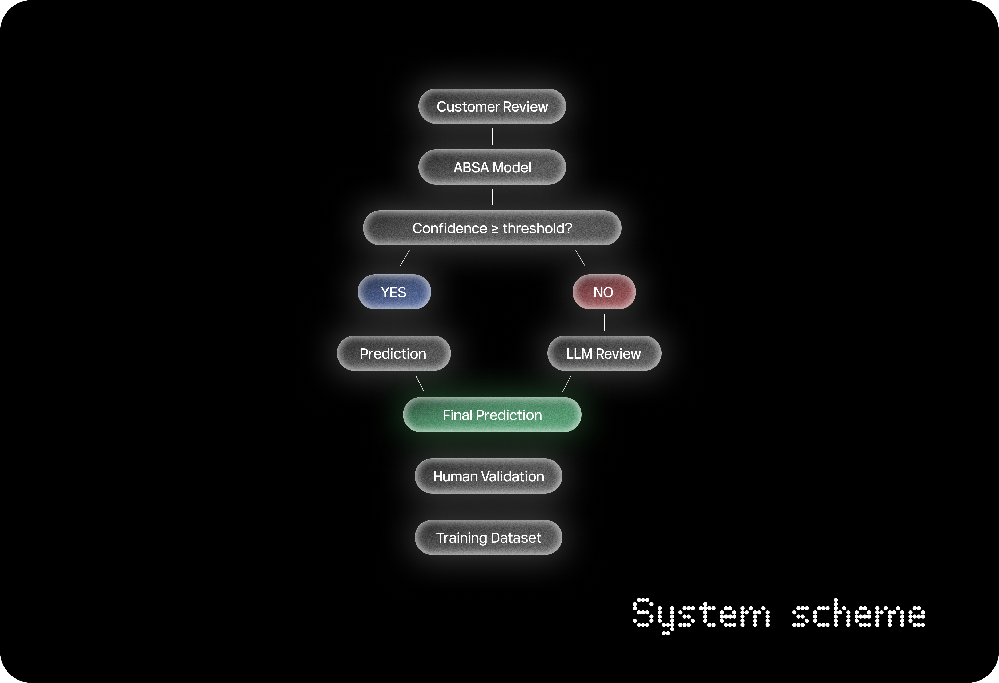

# Hybrid ABSA System

A hybrid Aspect-Based Sentiment Analysis pipeline for extracting
business insights from customer reviews.

The system combines:

- local ABSA model for fast inference;
- confidence-based routing;
- an LLM fallback for uncertain predictions;
- human review and correction;
- feedback logging for future model retraining.

## Problem

Traditional sentiment analysis assigns one sentiment to the entire review.
However, a customer may praise the food while criticising the service.

This project identifies individual aspects and determines sentiment
for each aspect separately.

## Base ABSA Model

This project uses the pretrained SetFit ABSA models developed by Tom Aarsen:

* Aspect model: `tomaarsen/setfit-absa-bge-small-en-v1.5-restaurants-aspect`
* Polarity model: `tomaarsen/setfit-absa-bge-small-en-v1.5-restaurants-polarity`

The models were trained on the SemEval 2014 Task 4 restaurant review dataset.

The ABSA pipeline uses:

* `spaCy` to identify possible aspect span candidates;
* a SetFit aspect model to filter valid aspects;
* a separate SetFit polarity model to classify sentiment;
* `BAAI/bge-small-en-v1.5` as the Sentence Transformer backbone;
* Logistic Regression as the classification head.

The original aspect model reports approximately 86.2% accuracy on the SemEval restaurant test set.

## Scheme

