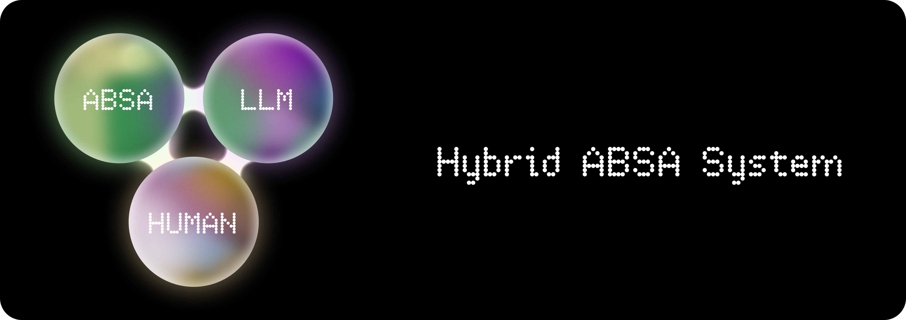
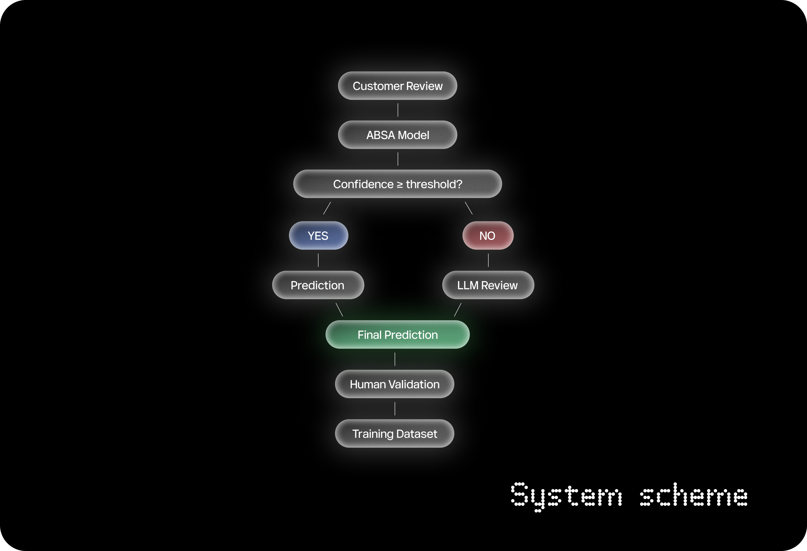

# Hybrid ABSA System

A hybrid Aspect-Based Sentiment Analysis pipeline for extracting business insights from customer reviews.

The system combines:

- local ABSA model for fast inference;
- confidence-based routing;
- an LLM fallback for uncertain predictions;
- human review and correction;
- feedback logging for future model retraining.

## Problem

Traditional sentiment analysis assigns one sentiment to the entire review. However, a customer may praise the food while criticising the service.

This project identifies individual aspects and determines sentiment for each aspect separately.

## Base ABSA Model

This project uses the pretrained SetFit ABSA models developed by Tom Aarsen:

- Aspect model: `tomaarsen/setfit-absa-bge-small-en-v1.5-restaurants-aspect`
- Polarity model: `tomaarsen/setfit-absa-bge-small-en-v1.5-restaurants-polarity`

The models were trained on the SemEval 2014 Task 4 restaurant review dataset.

The ABSA pipeline uses:

- `spaCy` to identify possible aspect span candidates;
- a SetFit aspect model to filter valid aspects;
- a separate SetFit polarity model to classify sentiment;
- `BAAI/bge-small-en-v1.5` as the Sentence Transformer backbone;
- Logistic Regression as the classification head.

The original aspect model reports approximately **86.2% accuracy** on the SemEval restaurant test set.

## Scheme

## Metrics

This directory contains the evaluation results of the proposed **Hybrid ABSA Pipeline**.

The pipeline was evaluated against the baseline SetFit ABSA model under two scenarios:

- **Full Dataset** (4,406 aspect-level samples)
- **Low-Confidence Samples** (699 samples automatically routed to the LLM)

### Full Dataset (4,406 Samples)

| Metric | Baseline ABSA | Hybrid Pipeline |
|---------|--------------:|----------------:|
| Accuracy | **0.8700** | **0.9467** |
| Macro Precision | 0.5675 | **0.9590** |
| Macro Recall | 0.5275 | **0.9063** |
| Macro F1 | 0.5400 | **0.9288** |
| Weighted F1 | 0.8600 | **0.9450** |

#### Per-Class F1 Score

| Class | Baseline ABSA | Hybrid Pipeline |
|-------|--------------:|----------------:|
| Conflict | 0.0000 | **1.0000** |
| Negative | 0.7400 | **0.9034** |
| Neutral | 0.4900 | **0.8426** |
| Positive | 0.9400 | **0.9691** |

### Low-Confidence Samples (699)

These samples were automatically routed to the LLM because the baseline ABSA model produced low-confidence predictions.

| Metric | Baseline ABSA | Hybrid Pipeline |
|---------|--------------:|----------------:|
| Accuracy | 0.4735 | **0.9599** |
| Macro Precision | 0.3410 | **0.8729** |
| Macro Recall | 0.3477 | **0.9687** |
| Macro F1 | 0.3406 | **0.9080** |
| Weighted F1 | 0.4631 | **0.9601** |

#### Per-Class F1 Score

| Class | Baseline ABSA | Hybrid Pipeline |
|-------|--------------:|----------------:|
| Conflict | 0.0000 | **0.7500** |
| Negative | 0.5768 | **0.9682** |
| Neutral | 0.3501 | **0.9514** |
| Positive | 0.4353 | **0.9625** |

## Summary

The baseline SetFit ABSA model achieved **87.0% accuracy** on the complete dataset. By selectively routing only **low-confidence predictions** to a Large Language Model (LLM), the proposed **Hybrid ABSA Pipeline** improved overall accuracy to **94.7%**.

The improvement was even more pronounced on the routed low-confidence samples, where accuracy increased from **47.4%** to **96.0%**. These results demonstrate that confidence-based routing enables the LLM to resolve the most uncertain predictions while allowing the lightweight local ABSA model to handle the majority of reviews efficiently.